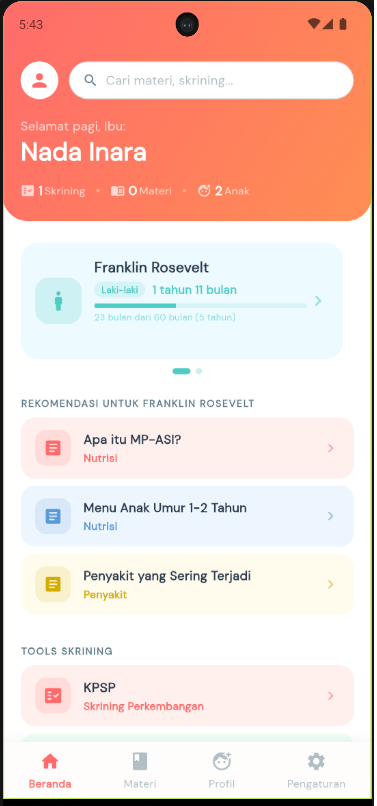
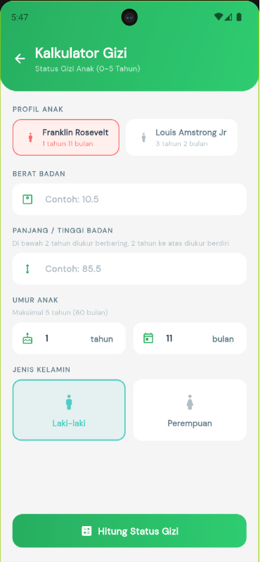
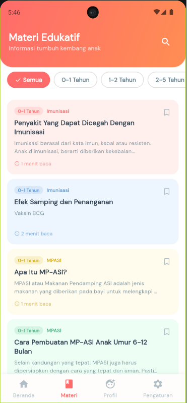
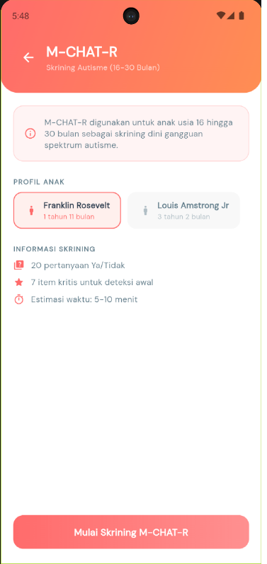

# 🌱 Ananda — Pantau Tumbuh Kembang Si Kecil dengan Mudah

<p align="center">
  
</p>

<p align="center">
  
  
  
  
  
</p>

<p align="center">
  <strong>Aplikasi monitoring tumbuh kembang anak usia 0–5 tahun</strong><br/>
  Dilengkapi tools skrining standar Kemenkes & kalkulator gizi berbasis WHO
</p>

---

## 📋 Daftar Isi

- [Tentang Aplikasi](#-tentang-aplikasi)
- [Fitur Utama](#-fitur-utama)
- [Screenshot](#-screenshot)
- [Tech Stack](#-tech-stack)
- [Persyaratan Sistem](#-persyaratan-sistem)
- [Instalasi & Setup Dev](#-instalasi--setup-dev)
- [Struktur Proyek](#-struktur-proyek)
- [Referensi Ilmiah](#-referensi-ilmiah)
- [Tim Pengembang](#-tim-pengembang)
- [Lisensi](#-lisensi)
- [Disclaimer](#-disclaimer)

---

## 🌟 Tentang Aplikasi

**Ananda** adalah aplikasi mobile Android yang dirancang untuk membantu **orang tua**, **tenaga kesehatan**, dan **kader Posyandu** dalam memantau tumbuh kembang anak usia **0 hingga 5 tahun** secara mudah, akurat, dan terpercaya.

Aplikasi ini dikembangkan berdasarkan pedoman resmi **Kementerian Kesehatan Republik Indonesia** dan standar **World Health Organization (WHO)**, sehingga seluruh penilaian dan interpretasi yang dihasilkan dapat dipertanggungjawabkan secara ilmiah.

> 💡 **Ananda 100% bekerja secara offline** — tidak memerlukan koneksi internet setelah instalasi.

---

## ✨ Fitur Utama

### 📚 Materi Edukatif
Konten edukasi berbasis usia yang komprehensif, mencakup:

| Kategori Usia | Topik yang Tersedia |
|---|---|
| 0–1 Tahun | Pertumbuhan, Perkembangan, Nutrisi & MP-ASI, Perawatan, Imunisasi |
| 1–2 Tahun | Pertumbuhan, Perkembangan, Nutrisi, Stimulasi, Perawatan, Permainan |
| 2–5 Tahun | Pertumbuhan, Perkembangan, Nutrisi, Stimulasi, Perawatan, Pencegahan, Permainan |

- 🔍 **Pencarian Cepat** — temukan materi dengan kata kunci
- 🔖 **Bookmark** — simpan artikel favorit untuk dibaca ulang

---

### 🩺 Tools Skrining

#### 1. KPSP — Kuesioner Pra Skrining Perkembangan
Skrining perkembangan sesuai panduan **Kemenkes RI**, tersedia untuk **16 rentang usia**:

> 3, 6, 9, 12, 15, 18, 21, 24, 30, 36, 42, 48, 54, 60, 66, 72 bulan

Hasil skrining dikategorikan sebagai: **Sesuai**, **Meragukan**, atau **Penyimpangan**.

#### 2. Kalkulator Status Gizi (WHO)
Menghitung dan menginterpretasikan status gizi anak berdasarkan:
- **BB/U** — Berat Badan menurut Umur
- **TB/U** — Tinggi Badan menurut Umur
- **BB/TB** — Berat Badan menurut Tinggi Badan
- **IMT/U** — Indeks Massa Tubuh menurut Umur

Menggunakan **tabel LMS WHO** untuk perhitungan Z-Score yang akurat.

#### 3. TDD — Tes Daya Dengar
Skrining kemampuan pendengaran anak berdasarkan kelompok usia:
- < 3 bulan
- 3–6 bulan
- 6–12 bulan
- 12–24 bulan
- 24–36 bulan
- > 36 bulan

#### 4. M-CHAT-R — Modified Checklist for Autism in Toddlers
Skrining risiko **Autism Spectrum Disorder (ASD)** pada anak usia **16–30 bulan**, dengan 20 pertanyaan terstandarisasi. Hasil berupa kategori: **Risiko Rendah**, **Risiko Sedang**, atau **Risiko Tinggi**.

---

### 👶 Profil Anak
- Kelola **multiple profil anak** dalam satu perangkat
- Riwayat skrining tersimpan otomatis per anak
- **Auto-fill usia** berdasarkan tanggal lahir
- Pengingat jadwal skrining berkala

---

## 📱 Screenshot

> 



*Coming soon — tambahkan screenshot aplikasi di sini*

---

## 🛠 Tech Stack

| Komponen | Teknologi |
|---|---|
| Framework | Flutter 3.x (Dart) |
| Database | SQLite via `sqflite` |
| State Management | Provider |
| Notifikasi | flutter_local_notifications |
| Fonts | Google Fonts |
| Storage | SharedPreferences + SQLite |
| Mode Operasi | 100% Offline |

---

## 📱 Persyaratan Sistem

| Spesifikasi | Minimum |
|---|---|
| Platform | Android 5.0 (API Level 21)+ |
| RAM | 2 GB |
| Storage | 50 MB ruang kosong |
| Koneksi | Tidak diperlukan |

---

## 💻 Instalasi & Setup Dev

### Prasyarat
- [Flutter SDK](https://docs.flutter.dev/get-started/install) versi 3.7.0+
- Android Studio / VS Code
- Android SDK & Emulator (atau perangkat fisik)

### Langkah Setup

```bash
# 1. Clone repositori
git clone https://github.com/your-username/ananda_app.git
cd ananda_app

# 2. Install dependencies
flutter pub get

# 3. Verifikasi setup
flutter doctor

# 4. Jalankan aplikasi (debug mode)
flutter run

# 5. Build APK (release)
flutter build apk --release
```

### Struktur Assets
Pastikan asset JSON tersedia di lokasi yang sesuai:
```
lib/data/json/
├── materials/
│   ├── 0-1/     # Materi bayi 0-1 tahun
│   ├── 1-2/     # Materi batita 1-2 tahun
│   └── 2-5/     # Materi balita 2-5 tahun
└── screening/
    ├── kpsp/    # Data soal KPSP 16 rentang usia
    ├── tdd/     # Data soal TDD
    └── mchat/   # Data soal M-CHAT-R
```

---

## 📁 Struktur Proyek

```
lib/
├── data/
│   └── json/              # Data JSON materi & soal skrining
├── models/                # Data models (ChildProfile, ScreeningResult, dll.)
├── screens/
│   ├── profile/           # Layar profil anak
│   ├── screening/
│   │   ├── kpsp/          # Layar skrining KPSP
│   │   ├── tdd/           # Layar skrining TDD
│   │   ├── mchat/         # Layar skrining M-CHAT-R
│   │   └── nutrition/     # Layar kalkulator gizi
│   ├── materials/         # Layar materi edukasi
│   └── settings/          # Layar pengaturan & informasi
├── services/
│   └── database_service.dart  # Manajemen SQLite
├── utils/
│   ├── constants/         # Konstanta (colors, app_info, legal_texts)
│   └── helpers/           # Data loaders & kalkulasi WHO LMS
└── widgets/               # Reusable UI components
```

---

## 📖 Referensi Ilmiah

Aplikasi ini dikembangkan berdasarkan sumber-sumber berikut:

1. **Kementerian Kesehatan RI** — *Pedoman Pelaksanaan Stimulasi, Deteksi dan Intervensi Dini Tumbuh Kembang Anak* (Kemenkes RI, 2016)
2. **World Health Organization** — *WHO Child Growth Standards: Methods and development* (WHO, 2006)
3. **Robins, D.L., et al.** — *Modified Checklist for Autism in Toddlers, Revised with Follow-Up (M-CHAT-R/F)* (2014)
4. **Kemenkes RI** — *Standar Antropometri Penilaian Status Gizi Anak* (PMK No. 2 Tahun 2020)

---

## 👥 Tim Pengembang

Dikembangkan oleh:

| Nama | Peran |
|---|---|
| **Noordiati, MPH** | Project Lead & Content Expert |
| **Presley F Felly, S.I.Kom** | Lead Developer |

**Institusi:** Poltekkes Kemenkes Palangka Raya  
**Tahun:** 2026

---

## 📄 Lisensi

© 2026 Poltekkes Kemenkes Palangka Raya. **All Rights Reserved.**

Aplikasi ini bersifat **Proprietary**. Dilarang mendistribusikan, memodifikasi, atau menggunakan kode sumber tanpa izin tertulis dari pengembang.

---

## ⚠️ Disclaimer

> **Ananda adalah alat bantu skrining, bukan alat diagnosis.**

Hasil yang ditampilkan dalam aplikasi ini bersifat **informatif** dan tidak dapat menggantikan penilaian klinis oleh tenaga kesehatan yang berkualifikasi. Orang tua dan pengguna dianjurkan untuk selalu berkonsultasi dengan **dokter anak, bidan, atau tenaga kesehatan** terpercaya untuk evaluasi dan diagnosis yang tepat.

Pengembang tidak bertanggung jawab atas keputusan medis yang diambil semata-mata berdasarkan hasil dari aplikasi ini.

---

<p align="center">
  Dibuat dengan ❤️ untuk generasi anak Indonesia yang sehat dan tumbuh optimal<br/>
  <strong>Ananda v1.0.0</strong> — Poltekkes Kemenkes Palangka Raya, 2026
</p>